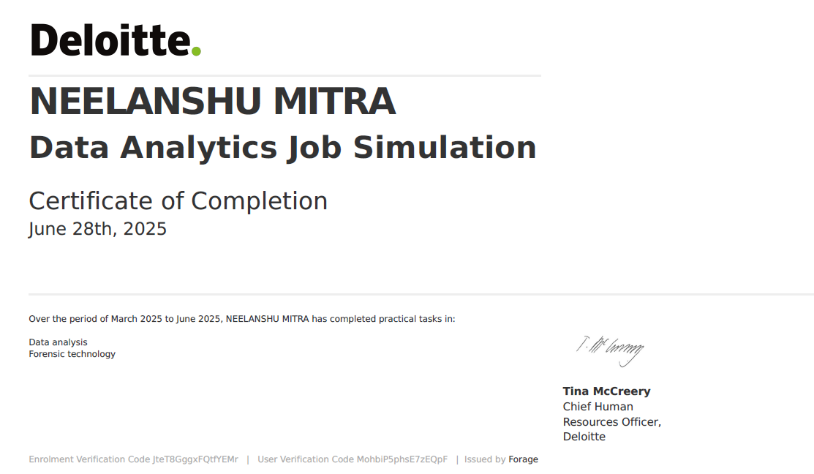

# Deloitte (AUS) Data Analysis
Data Analysis Virtual Intership and Job Simulation by Deloitte Austrilia on Forage. 

## Certificate

## Task-1
---
### Software - Tableau 

### Objective 
To analyze client data and create a dashboard using Tableau.

### Problem Statement
Using tableau create dashboard and analyze insight from the user data (JSON file) and find the hindrance in production.

#### Downtime Condition
IF[Status]="unhealthy" THEN 10 ELSE 0 END

---
## Task-2
---
### Software - Excel 

### Objective 
To analyze client data and categorize it regarding apy gap

### Problem Statement
An excel file containing 3 columns:
Factory Job Role Equality Score (integer; ranging between -100 and +100; 0 is ideal)
Create a 4th column (Equality class), classifying the equality score in those 3 types:
- Fair (+-10)
- Unfair (<-10 AND >10)
- Highly Discriminative (<-20 AND >20)

#### Command in Excel Cell
=IF(ABS(C2)<=10,"Fair", IF(ABS(C2)<=20, "Unfair", "Highly Discriminative"))
